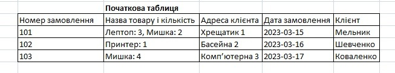
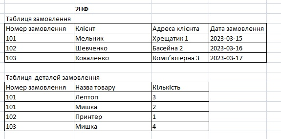
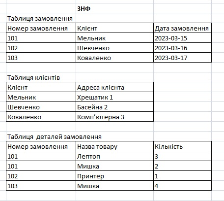

1. Переведіть початкову таблицю в першу нормальну форму.

2. Переведіть нові таблиці в другу нормальну форму.

3. Переведіть нові таблиці в третю нормальну форму.

4. Розробіть ER-діаграму отриманих таблиць.

5. Використовуючи ER-діаграму, створіть таблиці в базі даних. Оформіть ці
   таблиці без конкретних значень, тільки з урахуванням колонок та їхніх
   зв'язків, вручну або автоматично.

